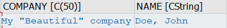
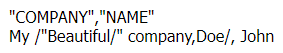

# ABAP CSV Manager


> Can I decide which character to use as delimiter, quotechar, and line terminator?

Certainly, once instantiated you can configure the csv management object:
```
DATA(csv_man) = NEW ztbox_cl_csvman( ).

csv_man->delimiter( |;| ).    " Fields delimiter, default is comma (,)
csv_man->quotechar( |"| ).    " To quote fields, default is none
csv_man->end_of_line( '|' ).  " Line-terminator char, default is Carriage Return and Line Feed (%_CR_LF)
```

You can also specify which character to use to escape special characters, both in read and write mode
```
csv_man->escapechar( |/| ).
```
In write mode,  generates  
