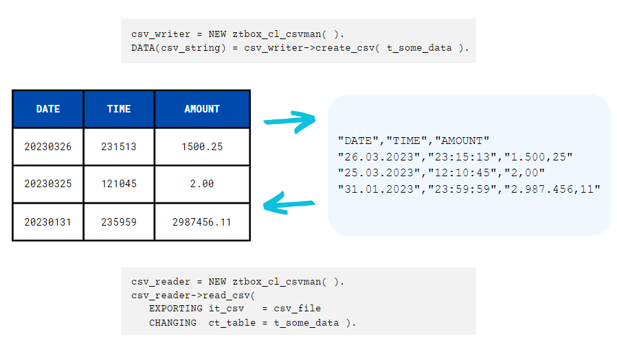

# ABAP CSV Manager



:office_worker: **Can I decide which character to use as delimiter, quotechar, and line terminator? And what about escaping special characters?**

:mage: Once instantiated you can configure the csv management object:
- ``csv_man->delimiter( `;` ).``  *Fields delimiter, default is comma:* `,`*.*
- ``csv_man->quotechar( `"` ).``  *To quote fields, default is none.*
- ``csv_man->end_of_line( `|` ).`` *Line-terminator char, default is Carriage Return and Line Feed* `%_CR_LF` *.*
- ``csv_man->escapechar( `/` ).`` *To escape special characters, both in read and write mode.*
- ``csv_man->doublequote( abap_true ).`` *To escape a quotechar character with a quotechar character.*
- `csv_man->quoting( ztbox_cl_csvman=>c_quote_minimal ).` *To restrict quoting application, with these options:*
  - `ztbox_cl_csvman=>c_quote_all` *to apply quotechar character to all fields (this is default behaviour if a quotechar is set);*
  - `ztbox_cl_csvman=>c_quote_minimal` *to apply quotechar character only to fields containing special characters;*
  - `ztbox_cl_csvman=>c_quote_nonnumeric` *to apply quotechar character only to non-numeric fields;*
  - `ztbox_cl_csvman=>c_quote_none` *to never quotes fields (this is the default behaviour if no quotechar is set).*
- `csv_man->header( abap_true ).` *To write/expect an header line in write/read mode
- `csv_man->header_desc( abap_true ).` *To use long label description (from data element, in the log-on language) as header text field. If the field is not typed with a dictionary data element its name is still used as its description*

:office_worker: **Nice, but I want also control fields output format, especially for date/time/numeric fields.**

:mage: Sure, you can use these configurations:
- ``csv_man->date_format( `yyyy/dd/mm` ).`` *To decide output format for date fields in write mode, or to declare expected format for date fields in read mode. You can use any format containing "dd", "mm", "yy", "yyyy" and an optional separator.*
- ``csv_man->time_format( `hh:mm:ss` ).`` *Same as above, but for time fields.*
- `csv_man->number_format( ).` *Three options here:*
  - ` ` *(blank) to output numbers like* `1.234.567,89`
  - `X` *to output numbers like* `1,234,567.89`
  - `Y` *to output numbers like* `1 234 567,89`
- ``csv_man->country( `US` ).`` *To output date, time and numbers according to a country rules (less specific than previous methods).*
- `csv_man->decimals( 3 ).` *To write numerical fields with the specified decimals precision.*
- `csv_man->convexit( abap_true ).` *To apply domain conversion exit, internal-to-external in write mode, external-to-internal in read mode.*
- `csv_man->condense( abap_true ).` *To remove leading and trailing spaces.*
- `csv_man->keep_init( abap_true ).` *To maintain initial values: if set to* `abap_false` *a numerical field containing only 0, as well as an initial date or initial time, became blank in write mode. Default option is* `abap_true`.
- `csv_man->alignment( cl_abap_format=>a_right ).` *To align fields content according to the following options:*
  - `cl_abap_format=>a_left` *To justify text on the left (default option)*
  - `cl_abap_format=>a_right` *To justify text on the right*

:office_worker: **Ok cool. These are global configuration, valid for all the fields, aren't they? What if I want to set some format property to one field and a different property to another?.**

:mage: You can restrict the application of the previous methods to a single field by calling `field( )` method first, also chaining other methods, e.g.:

```abap
csv_man->field( `AMOUNT_USD` )->number_format( `X` ).
csv_man->field( `AMOUNT_EUR` )->country( `IT` )->decimals( 2 ).
```
You can also exclude some fields from the CSV generation/reading process using `exclude( abap_true )` method:

```abap
csv_man->field( `MANDT` )->exclude( abap_true ).
```

Viceversa, if you work with a table having too many fields, you can generate or reading a CSV considering only a small subset of fields using `include( abap_true )` method. Once you have called `include` for a field, only fields for which `include` has been called will be considered.

```abap
csv_man->field( `MATNR` )->include( abap_true ).
csv_man->field( `WERKS` )->include( abap_true ).
```

If the order of the fields in the table does not match the columns in the CSV to generate or read, you can map each field with the corresponding csv-column position:

```abap
csv_man->header_desc( abap_true ).
csv_man->field( `MATNR` )->csv_position( 2 )->label( `Material!!!` ).
csv_man->field( `WERKS` )->csv_position( 1 )->label( `THE Plant` ).
```
In this way, the following table:
| MATNR  | WERKS |
| ------- | ------ |
| AAAA01  | US01  |
| BBBB02  | US02  |

gives this CSV as output:
```csv
THE Plant,MATERIAL!!!
US01,AAAA01
US02,BBBB02
```

`label( )` method set a custom header text when `header_desc( )` is used.

:office_worker: **Useful. Regarding reading the csv, is there an automatism to help identify errors in the data?**

:mage: We have it. When a CSV is read, some validation checks are performed according to the data type of the target fields: date fields (if not initial) must be a valid and plausible date; time fields (if not initial) must contain a valid and plausible time, numerical fields (if not initial) must contain a valid number. Whenever any of these check fail, the contents are not transferred. You get a detailed report for the validation fails by calling `get_validations_fails( )`.

Suppose you read this CSV:

```csv
31/02/2023,10:45:19,"1900,20"
28/02/2023,25:00:00,"-894,23"
31/12/2022,00:00:01,"12A4,43"
```

into a table with structure `DATE [D(8)] | TIME [T(6)] | AMOUNT [P(7) DEC(2)]`. The output will be
| DATE  | TIME | AMOUNT |
| ------- | ------ | ------ |
| 00000000 | 104519 | 1900.20 |
| 20230228 | 000000 | -894.00 |
| 20221231 | 000001 | 0.00 |

And the `get_validation_fails( )` output is this table:
| ROW  | COL | TABLE_FIELD | RAW_VALUE | SAP_VALUE | METHOD_FAIL |
| ------- | ------- | ------- | ------- | ------- | ------- |
| 1 | 1 | DATE | 31/02/2023 | | DATE_PLAUSIBILITY |
| 2 | 2 | TIME | 25:00:00 | | TIME_PLAUSIBILITY |
| 3 | 3 | AMOUNT | 12A4,43 | | VALID_NUMB |
